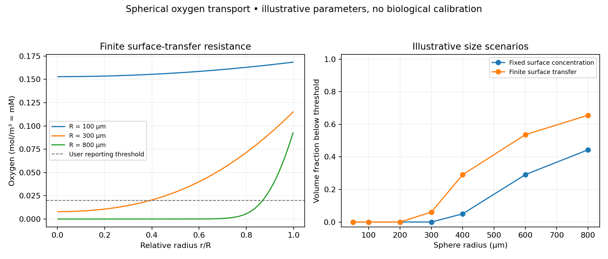

# Organoid Oxygen Lab

**Explore how sphere size, oxygen uptake and surface resistance shape oxygen
gradients in an idealized organoid.**

This CPU model solves steady spherical diffusion with Michaelis–Menten uptake.
It reports radial profiles, integrated uptake, surface influx, mass-balance
error and the volume below a user-selected concentration threshold. A finite
volume method keeps local uptake and diffusive fluxes consistent.

`oxygenlab sweep-vmax` holds radius fixed and raises illustrative `vmax`. The question is only whether core oxygen falls and mass balance stays small. It is not a fitted uptake.

`oxygenlab sweep-transfer --out artifacts/transfer --plot` holds radius and
uptake fixed while varying the illustrative surface mass-transfer coefficient
in m/s. It compares sampled core and surface oxygen with the fixed-surface
limit, and saves a CSV, settings JSON, report and labeled figure. This is a
boundary-resistance sensitivity check, not a measured coefficient or a
conversion from pump flow.

The [included numerical demonstration](examples/demo/REPORT.md) compares two
surface conditions across seven sphere sizes and checks an analytic reference
under mesh refinement. Parameters are **illustrative**, with no experimental
calibration or biological validation claim.



## Run

Python 3.10+, NumPy and SciPy; no GPU.

```bash
python -m venv .venv
source .venv/bin/activate
python -m pip install -e '.[plots]'
python -m unittest discover -s tests -v
oxygenlab demo --out artifacts/demo --plot
oxygenlab sweep-vmax --out artifacts/vmax
oxygenlab sweep-transfer --out artifacts/transfer --plot
oxygenlab solve examples/demo/parameters.json --out artifacts/sphere
```

Use `pip install -e .` and omit `--plot` for a smaller installation. Every
output directory must be new. `profile.csv` gives radial concentrations and
shell volume fractions. `summary.json` records settings, convergence and
conservation diagnostics, parameter/input hashes and software versions.

Configuration and report text use UTF-8 on every platform. Reports are prepared
in a temporary sibling directory before publication. Failed generation or
publication removes the new report, and an existing output path is never reused.
Publication reserves the destination exclusively and moves the prepared files;
it is not an atomic directory swap or a guarantee against a process crash or
power loss during those moves.

## Model and units

At steady state inside a homogeneous sphere,

$$\frac{D}{r^2}\frac{d}{dr}\left(r^2\frac{dc}{dr}\right)
  = V_{max}\frac{c}{K_m+c}.$$

Symmetry gives c′(0)=0. The surface is either fixed at the bath concentration,
or has inward oxygen flux D c′(R)=k(c_bulk−c(R)). The bath does not deplete.
The solver uses a dimensionless radial grid and a damped Newton method with
a positive first-order-uptake lower bound as its initial estimate.

| Parameter | Unit | Illustrative default |
|---|---|---:|
| `radius_um` | µm | 300 |
| `diffusivity_m2_s` | m²/s | 2 × 10⁻⁹ |
| `bulk_oxygen_mol_m3` | mol/m³ | 0.2 |
| `vmax_mol_m3_s` | mol/(m³·s), per tissue volume | 0.02 |
| `km_mol_m3` | mol/m³ | 0.01 |
| `transfer_m_s` | m/s; `null` means fixed surface | 2 × 10⁻⁵ |
| `threshold_mol_m3` | mol/m³, reporting threshold | 0.02 |
| `shells` | number of radial control volumes | 160 |
| `kinetics` | `michaelis_menten` or `zero_order` | `michaelis_menten` |

**1 mol/m³ = 1 mM = 1,000 µM.** A per-cell uptake rate cannot be used directly
as `vmax_mol_m3_s`; conversion needs a measured cell density per tissue volume.
No universal conversion from incubator gas oxygen percentage to the local
dissolved bath concentration is assumed.

The threshold controls a descriptive volume fraction. It is not a validated
hypoxia, death or potency threshold. Constant uptake is available chiefly for
the analytic reference; settings that predict negative oxygen are rejected.

## What has been verified

- Zero consumption recovers the bath concentration throughout the sphere.
- Constant uptake agrees with the independent closed-form solution for both
  surface conditions, with second-order mesh refinement in the smooth example.
- Nonlinear profiles agree with an independent SciPy boundary-value solver.
- Positive, radially increasing concentrations and matching integrated
  surface influx/uptake across the included size scenarios.
- Strict parameters, explicit units, volume-weighted summaries and source hashes.

CI runs unit tests and the full plotted demo on Python 3.10 and 3.12 on Linux and
Windows. Numerical correctness does not establish the suitability of a parameter
set for cells.

## Research use and limitations

Use this as a transparent starting model for a narrow question: how sensitive
is predicted oxygen availability to measured size, uptake or surface resistance?
The model assumes a homogeneous sphere at steady state. It excludes irregular
geometry, spatially varying cell density, vascularization, growth, necrotic
cores, other nutrients, explicit fluid flow and time-varying culture conditions.

The mass-transfer coefficient is a boundary parameter. It does not specify a
pump setting or predict perfusion flow. Your
[open-perfusion-rig](https://github.com/dylanstechmann/open-perfusion-rig) and
[perfusion-calibration-lab](https://github.com/dylanstechmann/perfusion-calibration-lab)
can support separate instrumentation work; measured flow still needs a fluid
transport model or experiments before informing k here.

See the [equations and discretization](docs/METHODS.md) and
[parameter/model card](docs/MODEL_CARD.md). A useful next milestone is fitting
uptake and boundary parameters to one permitted dataset, then checking the
profile against independent measurements and quantifying parameter uncertainty.

## References and license

- Leedale et al. (2021), [Mathematical modelling of oxygen gradients in stem cell-derived liver tissue](https://doi.org/10.1371/journal.pone.0244070).
- McMurtrey (2016), [Analytic Models of Oxygen and Nutrient Diffusion…](https://doi.org/10.1089/ten.tec.2015.0375).

These primary papers motivate the modeling questions. This package implements
its own reduced spherical model and does not reproduce their complete
experimental systems or claim their validation. MIT for original code and
numerical examples. No source-paper code, data or figures are redistributed.
