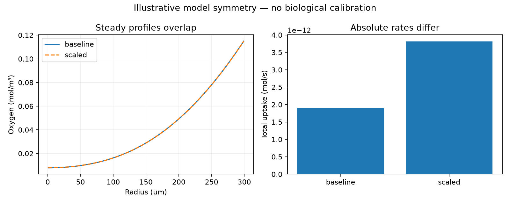

# Illustrative steady-profile equivalence

Constructed model settings; no measurements fitted.

D, Vmax and finite k scaled together by 2.
Maximum profile difference: 0 mol/m3.

Within this homogeneous steady sphere, scaling D, Vmax and finite k together preserves Da, Bi and Km/c_bulk, hence the concentration profile at the same physical radii.
Absolute uptake and influx scale; R^2/D changes. That diffusion scale is not a measured equilibration time.
More precise steady concentrations alone do not remove this symmetry. Independent rate, diffusivity or temporal information could constrain it only under valid model/measurement assumptions.
No unique fitted parameters, experimental identifiability, viability or recommended culture conditions are established.

