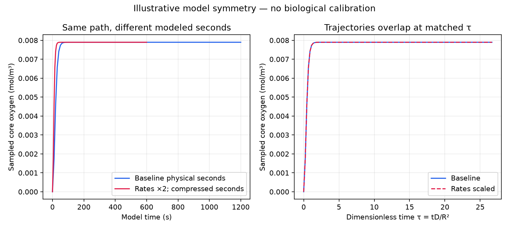

# Illustrative transient rate-scaling symmetry

**Constructed numerical comparison only. No biological measurements were fitted.**

The second parameter set multiplies diffusivity, maximal uptake and finite surface transfer by 2; it divides simulated physical time by the same factor and keeps geometry, bath, Michaelis constant, uptake law and initial concentration fixed.

| Check | Result |
|---|---:|
| Maximum transient profile difference at matched dimensionless times (mol/m³) | 0 |
| Maximum steady profile difference (mol/m³) | 0 |
| Baseline 95% core-change time (s) | 42.966 |
| Scaled 95% core-change time (s) | 21.483 |
| Baseline/scaled 95% time ratio (expected 2) | 2 |
| Uptake ratio at matched final state (scaled/baseline) | 2 |
| Surface-influx ratio at matched final state (scaled/baseline) | 2 |
| Maximum relative transient mass-balance error, baseline | 2.54e-10 |
| Maximum relative transient mass-balance error, scaled | 2.54e-10 |

For the same geometry, bath, uptake law, Km, initial profile and dimensionless time grid, jointly scaling diffusivity, maximal uptake and finite surface transfer (when present) preserves the backward-Euler transient concentration path when physical time is divided by that factor; a fixed-surface boundary remains fixed.
The characteristic diffusion scale R²/D and model-derived core-change times scale inversely with the rate factor. These are mathematical model times, not measured equilibration or biological response times.
Absolute uptake and surface influx scale with the rate factor at matched states; mass-balance checks are reported separately for both integrations.
No measurements were fitted. The constructed symmetry establishes no organoid-specific rates, oxygen response, viability, culture recommendation or biological validation.

